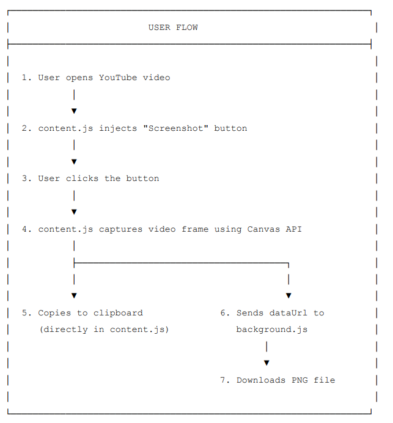
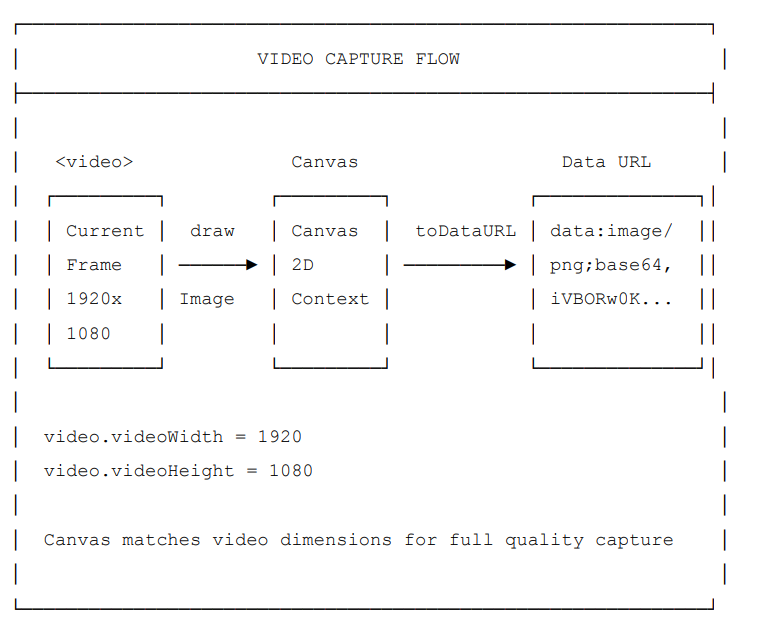

# YouTube Screenshot Extension

A minimal Chrome extension that adds a **Screenshot** button directly inside the YouTube player controls.  
With one click, you can capture the current video frame, copy it to the clipboard, and download it as an image.

## Flow

  

  

---

## ✨ Features

- 📸 Capture the current YouTube video frame instantly
- 📋 Copy screenshot directly to system clipboard (PNG image)
- 💾 Automatically download screenshot to your device
- 🎯 Clean integration into native YouTube player controls
- ⚡ Fast, lightweight, and minimal UI

---

## 🧠 How It Works

1. The extension injects a **Screenshot** button into YouTube’s player controls.
2. When clicked:
   - The current video frame is drawn onto a hidden `<canvas>`.
   - The canvas exports the frame as a `dataURL` (PNG image).
   - The image is copied to the clipboard using the Clipboard API.
   - A message is sent to the background script to download the image.
